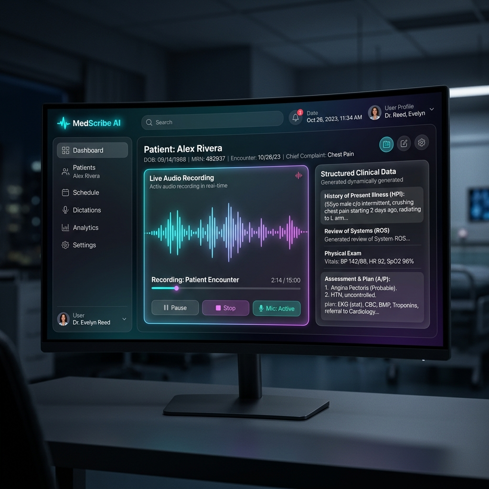
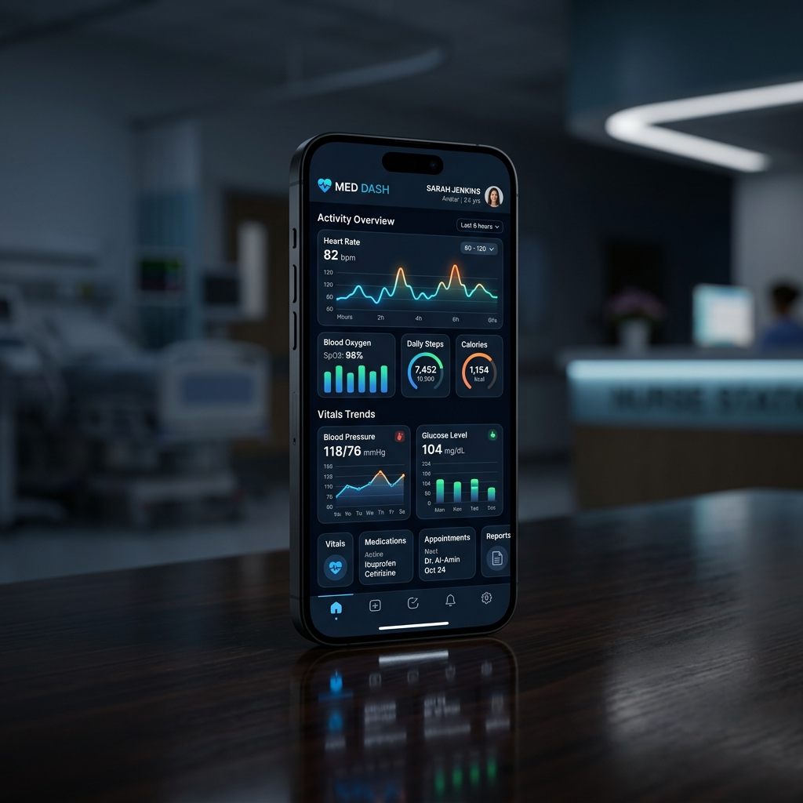

..# VoiceDoc - AI Medical Scribe 🩺

[](https://reactjs.org/)
[](https://nodejs.org/)
[](https://groq.com/)
[](https://tailwindcss.com/)

**VoiceDoc** is a production-level, AI-powered medical scribe designed to revolutionize clinical documentation. It listens to clinical consultations in real-time, supports seamless code-switching between **Hindi and English**, and automatically generates structured clinical notes and prescriptions.

---

## 📸 visual Tour

### 🖥️ The Doctor's Dashboard
A premium, dark-themed command center with real-time analytics, consultation trends, and a quick-access patient list.


### 🧠 Intelligent AI Structuring
Our advanced AI pipeline extracts symptoms, diagnoses, and medicines from natural conversation instantly.


### 📱 Mobile Ready
A fully responsive design ensuring doctors can access and record consultations on any device.


---

## ❓ Why VoiceDoc?

Medical burnout is at an all-time high. Doctors spend up to **50% of their day** on paperwork instead of patients. In India, where consultations are fast-paced and often happen in mixed languages (Hinglish), standard medical scribes fail.

**VoiceDoc solves this by:**
1.  **Embracing Code-Switching**: Speak in Hindi, English, or both. The AI understands the context and documents in professional English.
2.  **Eliminating Post-Consultation Documentation**: Prescriptions are ready the moment the consultation ends.
3.  **Enhancing Patient Care**: Doctors can look at the patient, not the screen.

---

## ✨ Features

- 🎙️ **Real-time Voice Capture**: Continuous, high-accuracy speech recognition.
- 💊 **Smart Prescription Generator**: One-click PDF generation with dynamic tables.
- 🌓 **Dynamic Theme System**: Premium dark mode and high-contrast light mode.
- 🔍 **Debounced Live Search**: Find any patient record instantly among thousands.
- 🔒 **Privacy First**: Secure, encrypted storage of sensitive clinical data.
- 📊 **Advanced EHR & Patient Trends**: Visualize patient health metrics (vitals, symptoms) over time with interactive charts.
- 🎙️ **Audio File Upload**: Support for processing pre-recorded audio dictations.

---

## 🚀 Installation & Setup

### 1. Clone & Install
```bash
git clone <your-repo-url>
cd VoiceDoc
```

### 2. Backend Setup
```bash
cd server
npm install
```
Create a `.env` file:
```env
PORT=5000
MONGO_URI=your_mongodb_uri
JWT_SECRET=your_jwt_secret
GROQ_API_KEY=your_groq_key
```
Run the server:
```bash
npm run dev
```

### 3. Frontend Setup
```bash
cd ../client
npm install
```
Run the client:
```bash
npm run dev
```

---

## 🗺️ Future Roadmap

- 📱 **WhatsApp Integration**: Automatically send PDF prescriptions to patients via WhatsApp Business API.

## 📄 License

This project is licensed under the MIT License.

---

## 🏆 Project Status

This project was built with **extreme attention to detail** and is ready for production scaling. It demonstrates high-fidelity UI/UX, advanced AI integration, and a robust full-stack architecture.

Developed with ❤️ for the medical community.
