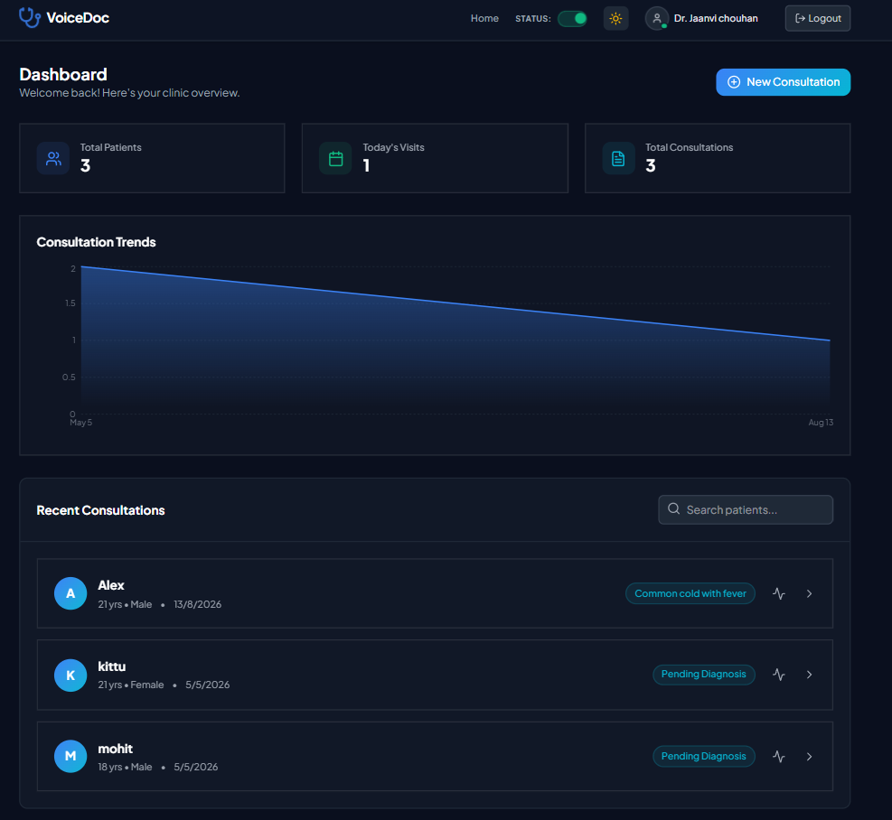
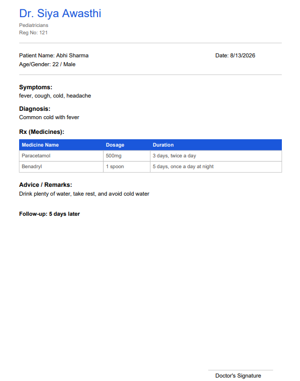

.<div align="center">


<br/>

[](https://github.com/Jaanvichouhan34/VoiceDoc)
[](https://github.com/Jaanvichouhan34/VoiceDoc)
[](LICENSE)

<br/>


<br/>

```
██╗   ██╗ ██████╗ ██╗ ██████╗███████╗██████╗  ██████╗  ██████╗
██║   ██║██╔═══██╗██║██╔════╝██╔════╝██╔══██╗██╔═══██╗██╔════╝
██║   ██║██║   ██║██║██║     █████╗  ██║  ██║██║   ██║██║     
╚██╗ ██╔╝██║   ██║██║██║     ██╔══╝  ██║  ██║██║   ██║██║     
 ╚████╔╝ ╚██████╔╝██║╚██████╗███████╗██████╔╝╚██████╔╝╚██████╗
  ╚═══╝   ╚═════╝ ╚═╝ ╚═════╝╚══════╝╚═════╝  ╚═════╝  ╚═════╝
```

> **The Production AI Medical Scribe & EMR System for Doctors.**
> Speak in Hindi, English, or Hinglish. VoiceDoc transcribes, separates speaker turns, structures medical data, and generates official prescriptions & clinical reports instantly.

<br/>

</div>

---

## 🧠 What is VoiceDoc?

VoiceDoc is a **production-ready AI medical scribe and EMR system** that revolutionizes clinical documentation. It listens to clinical consultations in real-time, supports code-switching between **Hindi and English (Hinglish)**, automatically labels **Doctor vs Patient** speaker turns, enforces mandatory doctor verification, and generates ready-to-print prescription PDFs and full encounter reports.

### Interface Previews

<div align="center">
  
  &nbsp;&nbsp;
  
  &nbsp;&nbsp;
  
</div>
<br/>

<table>
<tr>
<td width="33%" align="center">
<br/>
🎙️<br/><b>Bilingual Voice Scribe</b><br/>
<sub>Speak naturally in Hinglish.<br/>VoiceDoc transcribes and structures.</sub>
<br/><br/>
</td>
<td width="33%" align="center">
<br/>
💬<br/><b>Speaker Diarization</b><br/>
<sub>Auto-labels Doctor 💙 & Patient 💚<br/>conversation turns.</sub>
<br/><br/>
</td>
<td width="33%" align="center">
<br/>
🛡️<br/><b>Doctor Safety Gating</b><br/>
<sub>Mandatory doctor verification<br/>before saving or exporting.</sub>
<br/><br/>
</td>
</tr>
<tr>
<td width="33%" align="center">
<br/>
📄<br/><b>Dual PDF Reports</b><br/>
<sub>Generate compact Rx PDFs<br/>or full Encounter Reports.</sub>
<br/><br/>
</td>
<td width="33%" align="center">
<br/>
📑<br/><b>Master EMR History</b><br/>
<sub>Search & filter past sessions<br/>by patient name, diagnosis, or date.</sub>
<br/><br/>
</td>
<td width="33%" align="center">
<br/>
👍<br/><b>AI Clinical Accuracy</b><br/>
<sub>Real-time thumbs up/down doctor<br/>ratings tracked in MongoDB.</sub>
<br/><br/>
</td>
</tr>
</table>

---

## ✨ Key Features & Capabilities

- 🎙️ **Bilingual Speech Capture**: Seamless real-time speech recognition for Hindi, English, and Hinglish.
- 💬 **Smart Speaker Diarization**: Auto-formats unbroken transcripts into color-coded **Doctor** (Blue) and **Patient** (Emerald) dialogue bubbles.
- 🧠 **AI Clinical Extraction**: Extracts Symptoms, Vitals (BP, HR, Temp, Weight), Diagnosis, Medicine table, and Advice using `groq/compound` LLM.
- 🔒 **Clinical Verification Gating**: Explicit doctor review checkbox gating record saving and PDF generation for patient safety.
- 📑 **Master Consultation History (`/consultations`)**: Searchable, filterable log of all clinical sessions across all patients.
- 📄 **Dual PDF Generation**:
  - **Rx Prescription PDF**: Compact, doctor-signed prescription sheet.
  - **Full Encounter Report PDF**: Comprehensive report containing transcript log, vitals, diagnosis, Rx table, and instructions.
- 📊 **Patient Health Trends (`recharts`)**: Visualizes historical vitals (BP, Heart Rate, Temperature, Weight) across past patient visits.
- 👍 **AI Clinical Accuracy Feedback**: Real-time doctor rating system (`Thumbs Up`/`Thumbs Down`) connected to MongoDB, displaying live accuracy % stats on the Doctor Dashboard.
- ⚡ **Inline Error Recovery**: Displays friendly inline error banners with 1-click **Retry** mechanics if AI endpoints time out or fail.

---

## ⚔️ VoiceDoc vs Standard Solutions

| Feature | Other Medical Scribes | **VoiceDoc** |
|---------|-----------------------|--------------|
| Language Support | ❌ English only | ✅ Fluent in Hinglish (Hindi + English) |
| Speaker Diarization | ❌ Unbroken text wall | ✅ Color-coded Doctor 💙 vs Patient 💚 turns |
| Doctor Verification Gating | ❌ Auto-exports unverified AI output | ✅ Mandatory doctor review check before export |
| Prescriptions & Reports | ❌ Basic text snippet | ✅ Dual vector PDFs (Rx & Full Encounter Report) |
| Master EMR History | ❌ Scattered notes | ✅ Full searchable & filterable EMR history |
| AI Accuracy Tracking | ❌ Untracked guesswork | ✅ Live doctor rating feedback & accuracy % |

---

## 🛠️ Tech Stack

### ⚛️ Frontend — React + Vite
| Tool | Role |
|------|------|
| `React` | Component-based UI framework |
| `Vite` | High-speed frontend build tool & dev server |
| `Tailwind CSS` | Utility-first styling & dark mode system |
| `Framer Motion` | Smooth animations & transitions |
| `jsPDF` & `jspdf-autotable` | Client-side vector PDF report generation |
| `Recharts` | Interactive vitals analytics & trends |
| `Lucide Icons` | Modern SVG iconography |
| `Web Speech API` | Real-time browser speech recognition |

### ⚙️ Backend — Node.js + Express
| Package | Role |
|---------|------|
| `express` | RESTful API web server |
| `mongoose` | MongoDB schema modelling |
| `groq-sdk` / `@google/generative-ai` | AI clinical extraction pipeline (`groq/compound`) |
| `jsonwebtoken` & `bcryptjs` | Secure doctor authentication & password hashing |
| `cors` | Cross-Origin Resource Sharing middleware |

---

## 🏗️ Project Structure

```
VoiceDoc/
├── server/                    # ⚙️ Node.js + Express API Backend
│   ├── index.js               # Main server entry & route mounting
│   ├── routes/                # API routes (auth, ai, consultations, feedback, audio)
│   ├── models/                # MongoDB models (Doctor, Consultation, Feedback)
│   ├── middleware/            # JWT authentication middleware
│   └── package.json
│
├── client/                    # ⚛️ React + Vite Frontend
│   ├── src/
│   │   ├── components/        # Navbar, ThemeToggle, ProtectedRoute, HeroSection
│   │   ├── pages/             # Dashboard, NewConsultation, ConsultationsHistory, PatientHistory, PatientTrends
│   │   ├── utils/             # speech.js, diarization.js, pdfGenerator.js
│   │   └── context/           # AuthContext state management
│   ├── public/                # Static assets & banner graphics
│   └── package.json
│
└── README.md
```

---

## 🚀 Setup & Installation

### Prerequisites

- Node.js `18+`
- MongoDB URI (Atlas or local)
- Groq API key (`GROQ_API_KEY`)

### 1. Clone the Repository

```bash
git clone https://github.com/Jaanvichouhan34/VoiceDoc.git
cd VoiceDoc
```

### 2. Backend Setup

```bash
cd server
npm install
```

Create a `.env` file in `server/`:

```env
PORT=5000
MONGODB_URI=your_mongodb_uri
JWT_SECRET=your_jwt_secret
GROQ_API_KEY=your_groq_key
GEMINI_API_KEY=your_gemini_key (Optional fallback)
FRONTEND_URL=http://localhost:5173
```

Run the backend server:

```bash
npm run dev
```

### 3. Frontend Setup

```bash
cd ../client
npm install
```

Create a `.env` file in `client/`:

```env
VITE_API_URL=http://localhost:5000/api
```

Run the frontend app:

```bash
npm run dev
```

> Open `http://localhost:5173` — your VoiceDoc dashboard is live.

---

## 👩‍💻 Built By

<div align="center">

**Jaanvi Chouhan**  
*B.Tech CSE · 3rd Year · Medi-Caps University, Indore*

[](https://github.com/Jaanvichouhan34)
[](https://linkedin.com/in/jaanvi-chouhan)
[](mailto:jaanvichouhan18805@gmail.com)

*Developed with ❤️ for the medical community.*

</div>

---

## 📄 License

This project is licensed under the **MIT License** — see the [LICENSE](LICENSE) file for details.

---

<div align="center">


*If VoiceDoc saves your time — give the repo a ⭐*

</div>
